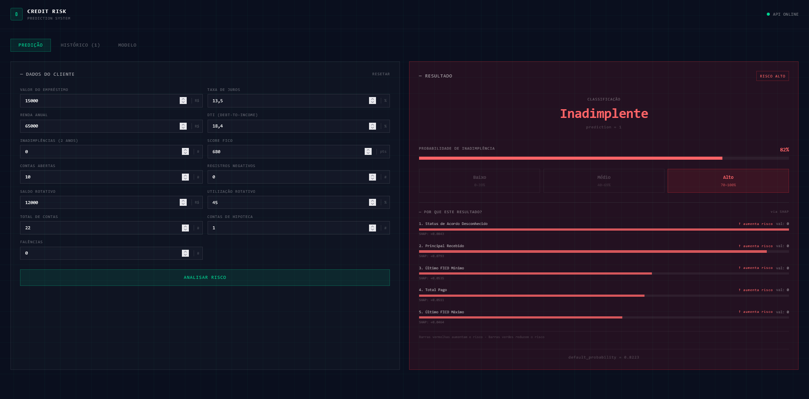
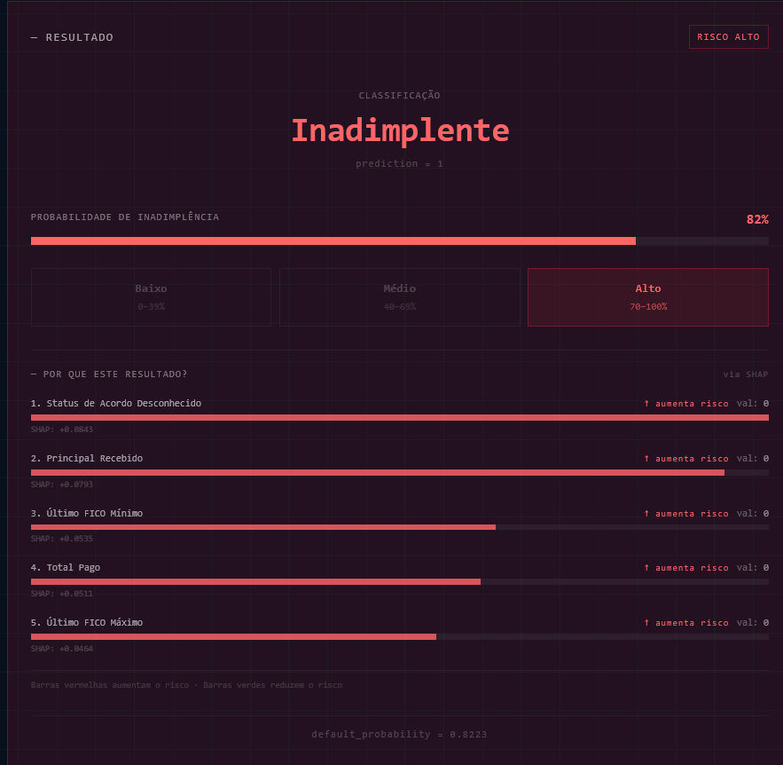
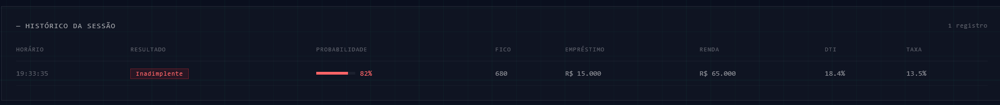
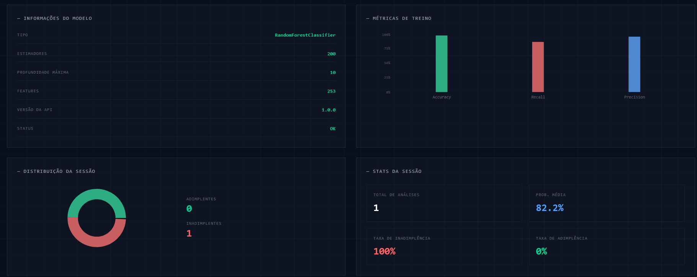

# 💳 Credit Risk Prediction System

[](https://www.python.org/)
[](https://fastapi.tiangolo.com/)
[](https://scikit-learn.org/)
[](https://react.dev/)
[](https://pytest.org/)
[](https://opensource.org/licenses/MIT)

Sistema de Machine Learning para **predição de risco de inadimplência** com base em dados reais de crédito (Lending Club, 2007–2018). O projeto cobre todo o pipeline — da ingestão e pré-processamento dos dados até uma API REST e um dashboard interativo com explicabilidade via SHAP.

---

## 📌 Sumário

- [Visão Geral](#-visão-geral)
- [Arquitetura de Solução](#-arquitetura-de-solução)
- [Estrutura do Projeto](#-estrutura-do-projeto)
- [Tecnologias](#-tecnologias)
- [Resultados do Modelo](#-resultados-do-modelo)
- [Como Executar](#-como-executar)
- [Usando a API](#-usando-a-api)
- [Dashboard](#-dashboard)
- [Testes](#-testes)
- [Melhorias Futuras](#-melhorias-futuras)

---

## 🎯 Visão Geral

O objetivo deste projeto é prever a **probabilidade de inadimplência** de um cliente a partir de seu perfil financeiro e histórico de crédito. O modelo é treinado sobre dados reais, exposto via API REST e visualizado em um dashboard React com explicabilidade por predição via SHAP.

**Fluxo do projeto:**

```
Dados brutos → Pré-processamento → Treinamento → Avaliação → API REST → Dashboard
```

---

## 🏛 Arquitetura de Solução

O sistema é dividido em três camadas independentes que se comunicam via HTTP:

```
┌─────────────────────────────────┐
│         FRONTEND                │
│       React + Vite              │
│       localhost:5173            │
│                                 │
│  ┌──────────┐  ┌─────────────┐  │
│  │Formulário│  │  Resultado  │  │
│  │ de Input │  │  + SHAP     │  │
│  └──────────┘  └─────────────┘  │
│  ┌──────────┐  ┌─────────────┐  │
│  │Histórico │  │   Métricas  │  │
│  │ Sessão   │  │  do Modelo  │  │
│  └──────────┘  └─────────────┘  │
└───────────────┬─────────────────┘
                │ HTTP / JSON
                ▼
┌─────────────────────────────────┐
│           BACKEND               │
│       FastAPI (Python)          │
│       localhost:8000            │
│                                 │
│  GET  /health  → status API     │
│  POST /predict → predição       │
│  POST /explain → SHAP values    │
└───────────────┬─────────────────┘
                │ joblib.load()
                ▼
┌─────────────────────────────────┐
│            MODELO               │
│         model.pkl               │
│                                 │
│  RandomForestClassifier         │
│  • 200 estimadores              │
│  • profundidade máxima: 10      │
│  • 253 features                 │
│  • treinado no Lending Club     │
│    dataset (2007–2018)          │
└─────────────────────────────────┘
```

### Camadas

**Frontend (React + Vite)** — interface web que o usuário acessa pelo navegador. Envia os dados do cliente para a API via HTTP e exibe o resultado, a explicabilidade SHAP, o histórico da sessão e as métricas do modelo.

**Backend (FastAPI)** — servidor Python que recebe as requisições do frontend, processa os dados, carrega o modelo e retorna as predições. Também computa os valores SHAP para explicar cada predição individualmente.

**Modelo (model.pkl)** — arquivo gerado pelo treinamento com `scikit-learn`. Contém o `RandomForestClassifier` serializado e a lista de features usadas no treino, garantindo que os dados de entrada sejam sempre alinhados corretamente.

---

## 🏗 Estrutura do Projeto

```
credit-risk-model/
│
├── api/
│   └── app.py                  # API FastAPI (predict, explain, health)
│
├── src/
│   ├── data_processing.py      # Limpeza, filtragem e feature engineering
│   ├── train_model.py          # Treinamento e avaliação do modelo
│   └── predict.py              # Lógica de predição isolada
│
├── tests/
│   └── test_api.py             # Testes automatizados com pytest
│
├── dashboard/                  # Frontend React + Vite
│   └── src/
│       ├── App.jsx
│       └── components/
│           ├── PredictionForm.jsx
│           ├── ResultCard.jsx  # Inclui explicabilidade SHAP
│           ├── HistoryTable.jsx
│           └── ModelMetrics.jsx
│
├── assets/                     # Screenshots do dashboard
│   ├── dashboard_preview.png
│   ├── result_dashboard.png
│   ├── history_dashboard.png
│   └── model_dashboard.png
│
├── data/                       # Datasets (não versionados — ver .gitignore)
│   ├── accepted_2007_to_2018Q4.csv
│   └── rejected_2007_to_2018Q4.csv
│
├── model.pkl                   # Modelo serializado após o treinamento
├── requirements.txt
├── .gitignore
└── README.md
```

---

## 🛠 Tecnologias

| Categoria        | Biblioteca                      |
|------------------|---------------------------------|
| Linguagem        | Python 3.10+                    |
| Manipulação      | Pandas, NumPy                   |
| Machine Learning | Scikit-learn                    |
| Explicabilidade  | SHAP                            |
| API              | FastAPI, Uvicorn                |
| Serialização     | Joblib                          |
| Frontend         | React, Vite, Tailwind CSS       |
| Gráficos         | Recharts                        |
| HTTP Client      | Axios                           |
| Testes           | Pytest, HTTPX                   |

---

## 📊 Resultados do Modelo

O modelo treinado é um **Random Forest Classifier** com os seguintes resultados no conjunto de teste:

| Métrica                  | Valor                    |
|--------------------------|--------------------------|
| Accuracy                 | 0.97                     |
| Precision                | Alta (ambas as classes)  |
| Recall (inadimplência)   | 0.86                     |

> Os dados utilizados são do dataset público do Lending Club, cobrindo operações de crédito de 2007 a 2018.

---

## ▶️ Como Executar

> **Pré-requisitos:** Python 3.10+, Node.js 18+ e Git instalados na sua máquina.

### 1. Clone o repositório

Abra o terminal e execute:

```bash
git clone https://github.com/LucasCunha00/credit-risk-model.git
cd credit-risk-model
```

### 2. Crie e ative o ambiente virtual

O ambiente virtual isola as dependências do projeto para não conflitar com outros projetos Python.

```bash
# Windows
python -m venv .venv
.\.venv\Scripts\activate

# Linux / macOS
python -m venv .venv
source .venv/bin/activate
```

> Você saberá que o ambiente está ativo quando aparecer `(.venv)` no início da linha do terminal.

### 3. Instale as dependências Python

```bash
pip install -r requirements.txt
```

### 4. Adicione os dados

Baixe os arquivos do [Lending Club Dataset](https://www.kaggle.com/wordsforthewise/lending-club) e coloque-os na pasta `data/`:

```
data/
├── accepted_2007_to_2018Q4.csv
└── rejected_2007_to_2018Q4.csv
```

### 5. Treine o modelo

Este passo processa os dados e gera o arquivo `model.pkl` na raiz do projeto. **Pode demorar alguns minutos** dependendo do hardware.

```bash
python src/train_model.py
```

> Você só precisa fazer isso uma vez. Após o `model.pkl` existir, não é necessário retreinar.

### 6. Suba a API

A API é o "cérebro" do sistema — ela carrega o modelo e responde às requisições de predição. **Mantenha esse terminal aberto** enquanto usar o sistema.

```bash
python -m uvicorn api.app:app --reload
```

Você verá uma mensagem como:

```
INFO: Uvicorn running on http://127.0.0.1:8000 (Press CTRL+C to quit)
```

Isso significa que a API está rodando. Você pode acessar a documentação interativa em: http://127.0.0.1:8000/docs

### 7. Suba o dashboard

**Abra um novo terminal** (sem fechar o anterior) e execute:

```bash
cd dashboard
npm install
npm run dev
```

Você verá:

```
VITE ready in Xms
➜  Local: http://localhost:5173/
```

Acesse o dashboard em: **http://localhost:5173**

> Se a porta 5173 já estiver em uso, o Vite usará automaticamente a 5174. Verifique a URL exibida no terminal.

---

## 🔌 Usando a API

### Endpoints disponíveis

| Método | Endpoint    | Descrição                                       |
|--------|-------------|-------------------------------------------------|
| GET    | `/`         | Status básico da API                            |
| GET    | `/health`   | Status detalhado + informações do modelo        |
| POST   | `/predict`  | Realiza a predição de risco de crédito          |
| POST   | `/explain`  | Retorna explicabilidade SHAP por predição       |

---

### `GET /health`

```json
{
  "status": "ok",
  "model": {
    "type": "RandomForestClassifier",
    "n_estimators": 200,
    "max_depth": 10,
    "n_features": 253
  },
  "api_version": "1.0.0"
}
```

---

### `POST /predict`

#### Validações dos campos

| Campo                  | Tipo  | Restrições          |
|------------------------|-------|---------------------|
| `loan_amnt`            | float | > 0, ≤ 1.000.000   |
| `int_rate`             | float | > 0, ≤ 100         |
| `annual_inc`           | float | > 0, ≤ 10.000.000  |
| `dti`                  | float | ≥ 0, ≤ 100         |
| `delinq_2yrs`          | int   | ≥ 0, ≤ 100         |
| `fico_range_low`       | float | ≥ 300, ≤ 850       |
| `open_acc`             | int   | ≥ 0, ≤ 200         |
| `pub_rec`              | int   | ≥ 0, ≤ 100         |
| `revol_bal`            | float | ≥ 0                |
| `revol_util`           | float | ≥ 0, ≤ 150         |
| `total_acc`            | int   | ≥ 0, ≤ 500         |
| `mort_acc`             | int   | ≥ 0, ≤ 100         |
| `pub_rec_bankruptcies` | int   | ≥ 0, ≤ 20          |

#### Exemplo de resposta

```json
{
  "prediction": 1,
  "default_probability": 0.8223,
  "label": "Inadimplente"
}
```

| Campo                 | Descrição                                          |
|-----------------------|----------------------------------------------------|
| `prediction`          | `0` = Adimplente / `1` = Inadimplente              |
| `default_probability` | Probabilidade estimada de inadimplência (0 a 1)    |
| `label`               | Classificação textual                              |

---

### `POST /explain`

Retorna as **5 features que mais influenciaram aquela predição específica** via SHAP, com direção do impacto.

#### Exemplo de resposta

```json
{
  "top_features": [
    {
      "feature": "last_fico_range_low",
      "importance": 0.0535,
      "value": 0.0,
      "direction": "aumenta"
    },
    {
      "feature": "total_rec_prncp",
      "importance": -0.0421,
      "value": 0.0,
      "direction": "reduz"
    }
  ]
}
```

| Campo         | Descrição                                                         |
|---------------|-------------------------------------------------------------------|
| `feature`     | Nome da feature                                                   |
| `importance`  | Valor SHAP (contribuição para a predição)                         |
| `value`       | Valor da feature naquela predição                                 |
| `direction`   | `"aumenta"` ou `"reduz"` a probabilidade de inadimplência         |

---

## 🖥 Dashboard

O dashboard é uma interface web interativa que se comunica com a API em tempo real. Para acessá-lo, siga os passos da seção [Como Executar](#-como-executar) e abra **http://localhost:5173** no navegador.

> **Importante:** a API Python precisa estar rodando em paralelo para o dashboard funcionar. O indicador no canto superior direito mostrará **API ONLINE** (verde) ou **API OFFLINE** (vermelho).



O dashboard possui três abas:

---

### Aba Predição

Formulário com os 13 campos do perfil financeiro do cliente. Preencha os dados e clique em **Analisar Risco** para obter a predição.



O resultado exibe:
- **Classificação** — Adimplente ou Inadimplente
- **Probabilidade de inadimplência** com barra visual
- **Zona de risco** — Baixo (0–39%), Médio (40–69%) ou Alto (70–100%)
- **Por que este resultado?** — as 5 features que mais influenciaram aquela predição via SHAP, com direção (↑ aumenta risco em vermelho / ↓ reduz risco em verde) e valor SHAP individual

---

### Aba Histórico

Registra todas as predições feitas durante a sessão atual.



Cada linha exibe: horário, resultado, probabilidade, score FICO, valor do empréstimo, renda anual, DTI e taxa de juros.

> O histórico é mantido apenas enquanto o dashboard estiver aberto. Ao recarregar a página, o histórico é limpo.

---

### Aba Modelo

Painel com informações técnicas e estatísticas da sessão.



Exibe:
- **Informações do modelo** — tipo, número de estimadores, profundidade máxima, features e versão da API
- **Métricas de treino** — gráfico com Accuracy, Recall e Precision
- **Distribuição da sessão** — gráfico de pizza com proporção de adimplentes e inadimplentes analisados
- **Stats da sessão** — total de análises, probabilidade média, taxa de inadimplência e adimplência

---

## 🧪 Testes

Testes automatizados com pytest que rodam **sem precisar do `model.pkl`** (usa mock do modelo).

```bash
pip install pytest httpx
pytest tests/test_api.py -v
```

| Categoria           | Cobertura                                        |
|---------------------|--------------------------------------------------|
| Health endpoints    | `/` e `/health`                                  |
| Predição            | Inadimplente, Adimplente, label correto           |
| Validação de inputs | 9 cenários inválidos + payload válido            |

```
15 passed in 1.37s ✅
```

---

## 🚀 Melhorias Futuras

- Balanceamento de classes (SMOTE / class_weight)
- Teste com XGBoost e LightGBM
- Deploy em nuvem (Railway, Render ou AWS)
- Pipeline de treino com MLflow para rastreamento de experimentos

---

## 👤 Autor

**Lucas Cunha**  
[](https://github.com/LucasCunha00)
[](https://www.linkedin.com/in/lucascunha2102)

---

> Projeto desenvolvido para fins de aprendizado e portfólio em Ciência de Dados e Engenharia de ML.